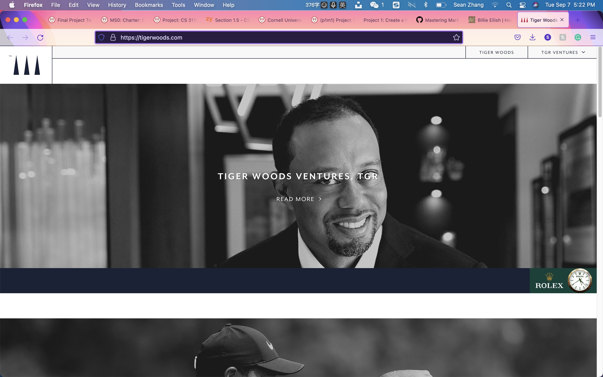
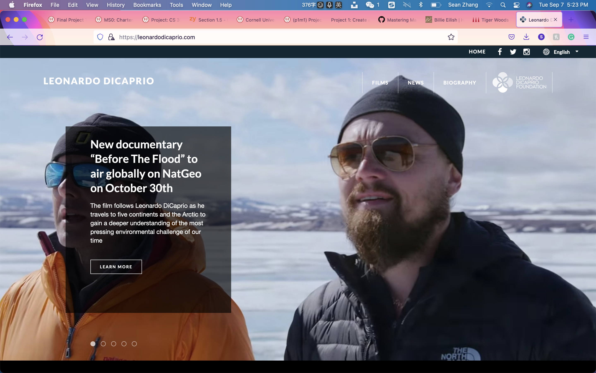
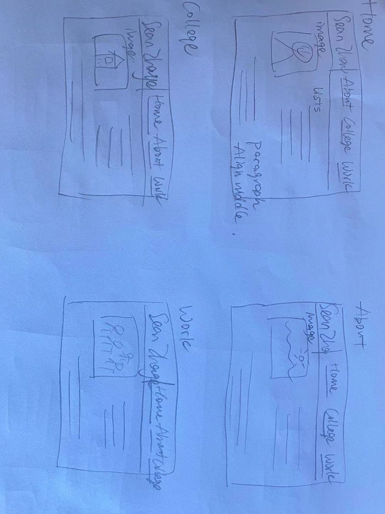
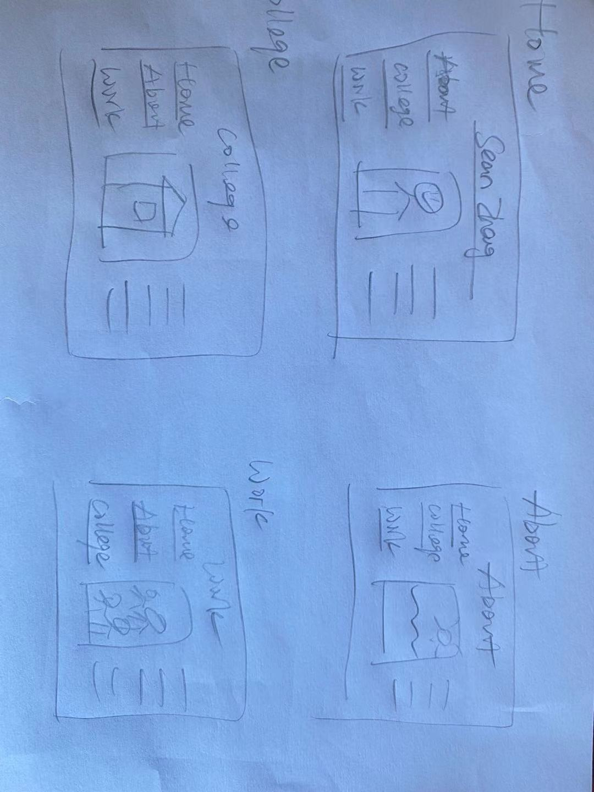
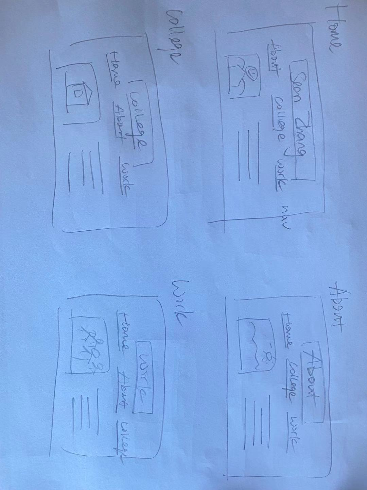
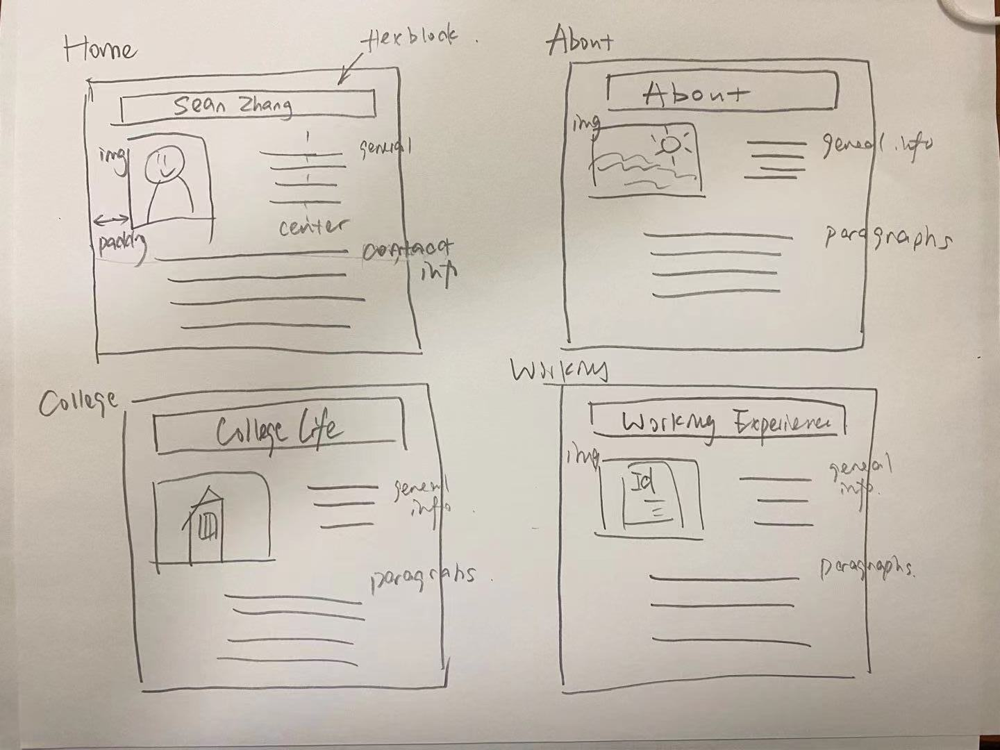

professionalprogramming# Project 1: Design Journey

**For each milestone, complete only the sections that are labeled with that milestone.**

Be clear and concise in your writing. Bullets points are encouraged.

**Everything, including images, must be visible in Markdown Preview.** If it's not visible in Markdown Preview, then we won't grade it. We won't give you partial credit either. This is your warning.

## Markdown Instructions

## Personal Website Design Exploration (Milestone 1)

Identify three personal websites that exist today on the web. Include a screenshot of the home page for each site. **We'll refer to these are your "example websites."**

1. <https://tigerwoods.com/>

    

2. <http://leonardodicaprio.com/>

    

3. <https://www.billieeilish.com/>

    

### Personal Website 1 Review (Milestone 1)
> Review the personal website you identified above. (1 paragraph)
> Who do you think this site is designed for? Who is its intended target audience?
> What do you like about the design?
> What could be improved about the design?

The personal website is designed for everyone who wants to get to know about the life of Tiger Woods. The intended target audiences are the fans of Tiger Woods, and people who love playing golf. I like how the design of this site is simple in style but strongly emphasized on Tiger Woods. With a huge picture of him on the center top of the website makes the purpose of this website clear and attract target audiences immediately. I would replace the front picture with Tiger Woods' golfing pictures. Because Tiger Woods is such a talented and well-known golf player, a golfing picture would be more iconic and more attractive to the intended target audiences as most of them would be golf lovers.

### Personal Website 2 Review (Milestone 1)
> Review the personal website you identified above. (1 paragraph)
> Who do you think this site is designed for? Who is its intended target audience?
> What do you like about the design?
> What could be improved about the design?

This site is designed for the fans of Leonardo DiCaprio and people who wants to know more about him. The intended and target audiences are also his fans and potentially people who had watch his movie and want to know him more. The design is very nicely organized, with pictures and descriptions that strongly emphasizes Leonardo and his recent activities. The color choice is dark which highly fits his style as a cool man. However, the design could be improved by making the name of Leonardo Dicaprio on a more centered and highlighted place. That way it would be easier for target audiences to notice and get attracted.

### Personal Website 3 Review (Milestone 1)
> Review the personal website you identified above. (1 paragraph)
> Who do you think this site is designed for? Who is its intended target audience?
> What do you like about the design?
> What could be improved about the design?

This site is designed for the fans of Billie Eilish and people who wants to know about her. The intended target audiences are her fans and music lovers. The design of this site is very artistic, with a very special color choice matching Billie's new album, and a strong emphasize on her. The site has many medias embedded, from videos to musics, which attracts the intended target audiences who wants to listen to her musics or watching her MVs. The design could be improved by putting more pictures of Billie Eilish on the site so that the site includes more contents about Billie herself instead of the musics. In this way, her fans and people who wants to know her more would be more satisfied.

## Personal Site & Audience (Milestone 1)

### Website Topic (Milestone 1)
> Briefly explain what your website will be about. Share your vision of your personal website.

My website will serve as a introduction of myself, similar to a online resume page, for potential employers in the programming and webmaking field, whom are my intended audiences. Therefore, the web will be about me(Sean Zhang). The website will include information about my life in the past, my background, my college and major information, and my working experiences. This website is intended to make the target audiences, whom are employers in the programming and web making field, to have a relatively clear understanding about who I am, my strengths, and my personalities, and to make them wanting to hire me for their jobs. The website is intended to make me look professional for both general jobs and specific programming related works, so that my target audiences, being employers, would be willing to hire me for the jobs.

### Audience (Milestone 1)
> Briefly explain who the intended audience(s) is for your website. Be specific and justify why this audience is appropriate for your site's topic.

The intended audiences are employers in the programming and web making field who are interested in hiring a programmer/web maker. The website is designed for the HRs in companies who tries to hire someone who has good web making and programming skills. These potential future employers are appropriate audiences for my personal website because the website introduces me，including many of my traits related to works that basically serves as a resume. This website will give them ideas about who I am and my ability to work. The personal website serves as their first impression on me which makes them easier to get to know me. Plus, with the goal of this website been a online resume for myself who wants to become a programmer/web maker, potential employers for these jobs are appropriate target audience for my website. Therefore, the employers in programming and web making field are appropriate target audiences of my website.

## Content Planning (Milestone 1)

Plan your site's content.

### Example Websites Content Review (Milestone 1)
> For each of your 3 example websites, identify the content on each site.
> List each piece of content for each site using a summary of the content.

Example Site 1:
- Tiger Woods
  1. TGR ventures
  2. TGR Foundation
  3. TGR design
  4. TGR Live
  5. The Woods

Example Site 2:
- Leonardo Dicaprio
  1. Films
  2. News
  3. Biography
  4. Leonardo DiCaprio Foundation

Example Site 3:
- Billie Eilish
  1. Videos
  2. Music
  3. Tour
  4. Store
  5. Documentary
  6. Book

### Your Site's Planned Content (Milestone 1)
> List the content you plan to include your personal website.

  1. General Information (name, birthday, photos, GitHub, etc.)
  2. Hometown, Where I from, My Growing up living places
  3. General Education background (primary school, middle/high school)
  4. My hobbies, what I like to do, etc.
  5. Course taking in college (CS, design Classes)
  6. fields of interest (NLP, ML, etc.)
  7. study away experience at Peking University
  8. What I think about my college experience
  9. What kind of job am I looking for
  10. My Working/Job skills (Programming language uses, etc.)
  11. summer intern experiences

### Content Justification (Milestone 1)
> Explain (about a paragraph) why this content is the right content for your site's intended audience.

This site serves as my personal website introducing me to the potential employers in programming and web making field. Therefore, the goal of this website is to make the employers want to hire me for the job. I think they will want me to demonstrate both my ability to work and my authentic personality. In the home page, which is the very first page my target audiences will see in my website, I included a picture of me in professional attire, and my general information, including name, contact information, etc. Because it is the first page the employers will see, and because the theory says that user would only have 20 sec to decide if they want to stay in this website, I must make my website look attractive. And to attract my target audiences, whom are from the programming or web making field, I will have to look professional both for jobs in general and in the field. Thus, I used professional picture of me, included contact informations, thus I made the webpage look like it is a professional person searching for jobs. Therefore, there will be a larger chance that the employers would like to hire me. In case of making myself look professional in the programming field, I specifically highlighted that I use GitHub, which is the largest community for programmers. Therefore, my target audiences would think that I am professional in CS field. There are three subpages to give my target audiences a better understanding of me. First, I want the employer to have a deeper idea about who I am, so I included in the About page many general information about myself, including my hometown and earlier education backgrounds. Thus, the audiences would know me better as a person. This will demonstrate that I am a nice person to work with. Second, because I will most likely be hired after graduating from university, my employer would like to see my college experiences and what I did there. So, I included the courses I took, interests I have, and some special experiences in my College Experience web page. I emphasized on the CS related works I have done because I am looking for a job as a programmer. Lastly, because I am applying for a job, I need to demonstrate my job skills and past working experiences, so that the employer have a better sense if I will do well at the job. Therefore, I included my Working Experiences as a page to show my working skills to impress the employer.

### Home Page Content (Milestone 1)
> Briefly identify what content you will include on the homepage and why this content should be the first thing your target audience sees when they visit your site.

- Home Page
  1. Welcoming line
    It is important to include a welcoming line to let the visitor feel a sense of welcomed, thus the visitor would have a more positive  feeling to this website. This is especially important for the employers because I want to make sure he holds a positive feeling about me so he will hire me for the job.
  2. Name
    My name should be highly emphasized to let the employer remember me. It is the central theme of this website.
  3. Photos of myself
    Photos would make employers know me better. It would also make them feel closer to me by seeing my face. I would include some photos in formal clothes so I look professional to the employers.
  4. contact information
    This is very important information. I want the employers to contact me for the job so I want them to know my contact information for sure.
  5. Links to other pages
    If they have further interest about me, I want them to stay in my website by easily navigating to my other personal webpages for more information about me. Therefore, they know me better and would have a larger opportunity to hire me for the job.

## Information Architecture (Milestone 2)

### Content Organization (Milestone 2)
> Document your iterations of card sorting here.
> Include photographic evidence of each iteration of card sorting and description of your thought process for each iteration.

1.

Sorted by: General Information, Job Related Information, Life Experiences
Idea: General information is a brief impression about me, Job Related Information are information that is related to work skills, CS field or designs. Life Experience is in general college life, daily life etc.

2.

Sorted by: General Information, My interests, My Experiences
Idea: General information is very general about me. My interests is about my hobbies, the job I want to do, the fields I am interested, etc. My experiences is about the interesting experiences I had in my life.

3.

Sorted by: General Information, College Life, Working experiences
Idea: General information is about my basic information. College Life is about my College Experience and college related works such as studies and fields of interests. Working experience is about working skills, past intern experiences etc.

### Final Content Organization (Milestone 2)
> Which iteration of card sorting will you use for your website?

- Home
  1. picture of me
  2. general information and Welcoming
  3. contact Information (phone, email, GitHub...)

- About
  1. General Information (name, birthday, photos, etc.)
  2. Hometown, Where I from, My Growing up living places
  3. General Education background (primary school, middle/high school)
  4. My hobbies, what I like to do, etc.

- College Life
  1. General College Information
  2. Course taking in college (CS, design Classes)
  3. fields of interest (NLP, ML, etc.)
  4. study away experience at Peking University
  5. What I think about my college experience

- Working Experiences
  1. What kind of job am I looking for
  2. My Working/Job skills (Programming language uses, etc.)
  3. summer intern experiences

> Explain how the final organization of content is appropriate for your site's audiences.

My website will be about myself, and my target audiences are potential company employers who looks for hiring programmer/web designers. My website serves as a introduction of myself to these company HRs to help them getting to know me better.

First, the About page would give them a general idea about who I am, including many basic background information such as where I from, where I grow up, and what my hobbies are. These general information gives them a brief idea about my personality, and me as a person. This page serves to give a most basic impression of me to the employers.

Second, the College Experience page gives audiences idea about my college life. I included information that is related to my college experience in this page, such as my courses, researches, and fiels of interests. As a college student, my college activities and courses are the primary concern of my potential employers. I want them to know what I studied in college, so I included courses I took, fields I am interested in, and researches I involved in to show the diverse experience I have in college.

Lastly, the Working Experience page demonstrates my working ability to ensure that I am capable of doing the job. I included information related to my working experience in this page. The employers will want to know if I am capable for the job they provided, and this page is the assure them I have the ability to work well. I included my job skills and intern experiences in the page so they get to know my past Experiences and know how well I could work.

For all the information I provided, I especially highlighted my design and programming related skills and experiences because I am looking for a job involving these two fields. Thus, the employer might want to see my experiences in these fields to assure that I am capable for the job. With this

### Navigation (Milestone 2)
> Please list the pages you will include in your personal website navigation.

- Home
- About
- College Life
- Working Experiences

> Explain why the names of these pages make sense for your site's audience.

The home page is the root page for all subpages, and it is the first webpage for the audiences to view. Following most website's naming rules, I named my root directory page my home page to make audiences easy to apply their used ways of browsing website on my website. Thus, they would feel that my website is easy to use. I also include the most important informations in the home page because it is the first thing my target audiences would see so I want to emphasize those information to them.

The first subpage, About, is used by many websites to give a brief introduction to the site's main content. The About page in my personal website is also giving a basic introduction of me to my potential audiences, So I used it here because it naturally makes sense to the audiences what the about page will be about.

The second subpage, College Life, is about my college life experiences. It is a primary concern of my audiences who are employers because I am currently a college student and they will want to know what I did in my college life. So, making it a big topic of my webpage and including many information about it in this webpage is ideal for my potential audiences.

The third subpage, Working Experiences, is often highly valued in the job market. For my target audiences, since they are looking for a worker, they would like to know my working skills and past working experiences to better determine if I am capable of the job. Thus, including working experience in my website as a big page theme is ideal.

## Visual Themes (Milestone 3)

**Make the case for your decisions using concepts from class, as well as other design principles, theories, examples, and cases from outside of class.**

Remember to focus on the things we can't see just by looking at the site: changes, alternatives considered, processes, and justifications.

Each section is probably around 1 reasonably sized paragraph (2-4 sentences).

### Theme Ideas (Milestone 3)
> Discuss several (more than two) ideas about styling your site's theme. Explain why the theme ideas are appropriate for your target audiences.

My target audiences are potential employers of programmers/web makers. My website serves to introduce me to these potential employers so that they would be willing to hire me for the job. Thus, it is my top priority to make my website look professional. In that case, i would make the color theme of my personal website black, grey, and white to make it seem formal because these colors look calm and plain to most people thus look professional. Plus, since my target audiences are from programming and web making field, they would have a lot of interest in coding works. In coding works, often the colors are black and white, with keywords highlighted as different colors. For example the atom editor is using this way of color theme. Thus, I think black, white, and grey would make a great combination for my target audiences to like the website. I thought about making the website to look young and active, as I am still young, to demonstrate my activeness and enthusiasm. In that way I would use light blue or orange to make the website look fresh and energetic. However, after carful consideration, I would still choose black and white because it is for employers and they would want someone who is professional and calm so the person can work well in the job market. Following the same design principle, I would make the blocks squares or rectangles, often with sharp corners, because the regular shapes would look formal to people. I will make the paragraphs have font Times New Romans or Sans-Serif because it is the easiest to read font. That would make the potential employers willing to read more about me. Plus these fonts are formal which again made my website look more professional. I would make the imageries look professional, with a picture of me in suits and two landscapes of my hometown and my college. This would not only make potential employers know me better, but also make me look professional. The entire website will be neat to show that I am a very organized and dedicated person, thus making the employers think I am capable for their jobs.

### Final Themes (Milestone 3)
> Which two themes did you select as your final candidates? Why?

The website I design makes me look very professional and ready to work, and the website is made to look attractive to programmers and coders which are both in my target audiences range, thus the potential employers who tries to hire programmers and web makers, whom are the target audiences of my website, will be interested in hiring me. By making the website in black and white background color, using regular shapes like squares or rectangles, using easy-to-read fonts like Times New Romans and Sans-Serif, and adding formal pictures of me and places related with me, I will make my personal website look professional and attractive to my target audiences.

### Theme Design (Milestone 3)
> Discuss your 2 final theme designs: how did you come to them, what are their strengths and weaknesses, how do they fit your overall design goals and audiences?

I designed my final design theme with a target audience experience thinking process. I addressed their needs first: easy-to-read, organized, and informative. With that, I makes the font easy-to-read, contents well organized, and information about me interesting. Then, I analyzed my target audiences and what they might like. Since they are from the programming and web making field, they will have a lot of involvement with coding. Thus, they will be used the coding environment and when they see that, they will think it as professional. In that case, I made my website coloring theme look like the coding environment, with basic colors like black, white and grey. Thus, my target audiences would like my website and be wanting to hire me because I look professional. I then characterizes the person they want to hire, which is my goal to get employed by them. I think they would want people that are professional, dedicate, and capable for the job. With that in mind, I made my theme look professional with black and white background color, everything organized, and emphasizes my working abilities.

> Emotion is a big part of design. What emotions where you thinking about or trying to convey in your designs?

I was trying to convey a sense of calm and professional. For the employers, they would want someone that is professional and easy to work with. Thus, I conveyed a sense of calm to show that I am a nice person that can easily work with. My target audiences thus will be very interested because they would think that I am a good person to work with in their career. I also demonstrate the professional aspect of myself so they no I will be doing good with the job. These emotions convey to them would make them believe I am a good person to hire for the job.

## Layout & Composition (Final Submission)

### Home Page Layout (Final Submission)
> Include several sketches of possible layout ideas for the home page.
> Provide an explanation for each sketch explaining the idea.
> Show your design process.

1.

For this layout idea, I put the my name and the navigation bar in the same row, and image surrounded by texts.
As I browse through different websites with good designs, I found the navigation bar position important as it should be easy for the user to understand what it is doing to clarify confusions. Putting in on top makes it very clean and easy to understand.

2.

For this layout design, I put the navigation bar on the left hand side with a vertical alignment. In this way, with image on the middle and texts on the right hand side, the three rows are in a nice order. However, I found this layout to be less attractive because the navigation bar should have a higher order of importance comparing with the image and paragraphs, therefore, putting them on the same level is not so appropriate.

3.

This is my favorite layout idea. With my name being the most important element, I highlighted it with a block with different kind of color and align it on the center. Then, the navigation bar right below it aligned in row which is easy for users to understand what it is doing. The image and texts are nicely ordered which makes the webpages look appealing.

### Final Site Layout (Final Submission)
> Include a sketch of the final layout for each page in your site.
> Provide an explanation below each sketch.

I choose layout 3 from my previous 3 layout design ideas. First, standing from my target audiences' perspective, I think this layout is very clear that it won't raise much confusion, which makes the user experience nice. Second, This layout provides very organized structure, with elements aligned in the middle of their own designated block positions. Third. This layout is very artistic and simple. It uses very simple structure to convey a sense of calm and profession, which also reveals the beauty of this simplicity. Therefore, I think this layout is very nicely formatted.

## Rationale (Final Submission)

**This rationale should be polished writing: one you might submit as a report to a client or boss to help explain the project and convince them you did a good job. You'll be surprised how much writing and communicating you need to do about projects and choices on internships and jobs; practice that here.**

It should be a comprehensive, complete story of the project. You might find that each section runs a few paragraphs (1-2). Sketches can often help tell the story of your design. Screenshots are also useful for describing issues discovered during the design process and how you addressed them.

**All images must be visible in Markdown Preview for credit!**

Your rationale should be a polished version of the earlier explanations.

### Audience (Final Submission)
> A complete and polished description of the intended audience(s) for your website.

The intended audiences are employers in the programming and web making field who are interested in hiring a programmer/web maker. The purpose of this personal website is to serve as a online resume of me that introduces me to the potential employers in the job market. Because my goal is to find a job, the appropriate target audience group is potential employers who is in need to hire someone. And since my major is CS and I am learning to become a programmer or a web maker, employers from programming or web making field are my true target audiences because they are searching for employees like me and they will offer the job I am interested in working for.

### Design Goals (Final Submission)
> An explanation of the design goals for that audience, based on your earlier rationales.

The final design goal is to make my target audiences, whom are potential employers interested in hiring a programmer or web maker, to want to hire me for their jobs. Therefore, the goal of this website is to introduce me to the target audiences, raise their interest in me, impress them with my past experiences, and make them want to hire me for their jobs.

### Content Organization & Navigation (Final Submission)
> An explanation of how the final content organization and navigation met your goals and why its appropriate for your audience(s).

Through my design process, I discovered that it takes stages to get to my final goal of this website, which is to make my target audiences to want to hire me. There can be four stages, which helps me make the decision about how to split my contents through webpages. First, I need to introduce myself briefly and quickly attract my audiences. Because there is only 20 seconds for a user to decide whether they should stay or leave, i include my most important information in my first (home) page. Second, I have to raise the interest of my taget audiences to make them think I am a good person and want to continue browse. Therefore, in the second (About) page, I included my background information, many past experiences such as my hometown, where I have lived, and my hobbies to make my audiences think I am a interesting person. Third, I need to impress my target audiences with my ability to work for them. Therefore, I made the third page about my college experiences, including the courses I took, my interested fields, activities I have done, which are all related to the programming and web making field. Thus, my audiences would get impressed and think I am capable for their job. Last, I need to make sure they want to hire me for the job. So, I included my working experiences in the past in my last webpage to demonstrate that I am a good worker. Therefore, seeing all I can do, my target audiences would want to hire me for their jobs.

### Visual Design (Final Submission)
> An explanation of how the final design met your goals and why its appropriate for your audience(s).

The visual design of my website is appropriate for my audiences in many ways. First, because this website is for potential employers, I want it to be professional to demonstrate my traits as a good worker. Therefore, I use black, white, and grey, which are all good colors for a professional resume, as my color theme to keep the style simple. I used formal and easy to read fonts, Times New Romans, to make my audiences' reading experience well. I also used Sans-Serif as my back up font plan to make sure my website works. I mostly used sharp corner rectangles for my blocks and shapes. It would look formal and professional for my audiences. Second, for the layout of my website, I made it simple and organized so my audiences would easily spot important informations, and the logic of using my website will be simple. I made all my blocks flexible so website can adjust to different size of screens. I applied similar style to every webpage, with a navigation bar right below the page title block, a picture on the central left, general information about the page on the central right, and more information at the bottom. Therefore, the visual theme of all my webs are aligned, making the entire website look professional and organized. To conclude, the visual designs I made would make my website look formal and professional, thus help me to achieve my final goal.

### Self-Reflection (Final Submission)
> What did you learn from this assignment? What are some of your strengths and weaknesses?

Through this assignment, I have learned a lot about website making and designing. First, I learned that making website is hard, and making good website that will work as intended is even harder. Coding for CSS is a very difficult job. I had to adjust the padding of block and rearrange the html codes in different section for a tons of time to get to a point where I was satisfied. I learned to always start early for the coding part because it is always more difficult than it seems. Second, I learned the importance of design in the web making process. I sketched many drafts before going into the coding process which saved me a lot of time. Also, sketch on paper is a very easy way to prototype the website, and it is nice to plan for the entire site. Last, I learned how to design by standing on the perspective of my audiences. Identify potential audiences is a very important work in web making and in many more fields. Learning what the audiences want and think on their point of view will make the design much more efficient and easy to use. I did researches on what kind of person employers would want which guides me through my design for my website. To conclude, through this assignment, I have learned to start coding early, design before writing codes, and standing on target audiences' perspective when making the design.
